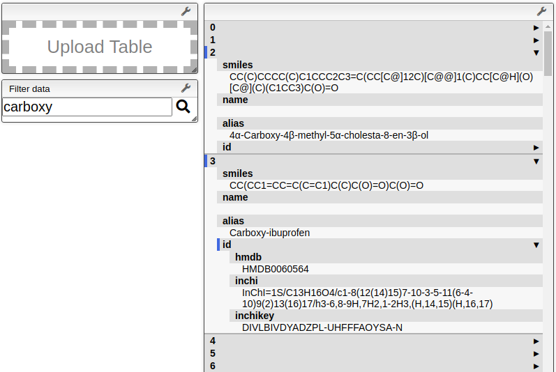

# Metabolite Data Aggregator
#### Mr. George L. Malone
#### 6th of May, 2021

### Overview

This repository contains the components of a method for aggregating metabolite
data into a table or set of tables, typically defined as JSON.

### Construct

Initial construction of the table required the use of a JSON containing data
from PathBank (the arrangement and formatting of which is described [here][1])
and the output from the [KEGG REST API][2] operation `/list/compound`.

### Add

Additional data were gathered from KEGG Compound data, which were collected
given the IDs provided in the KEGG List Compound operation.  Further data were
collected from HMDB and added to the entries that were found to have matching
SMILES codes.  Recently, KEGG Reaction, Module, and Pathway data have been
collected to enable visualising KEGG Pathways and Modules.

### Collect

Additional data, such as KEGG and HMDB data, were collected as reference data
and to add to the table.  This requires a mix of JavaScript and Ruby for the
HMDB data -- all HMDB data initially came from the _All Metabolites_ XML
provided at [the HMDB Downloads page][3], which, using Ruby, was broken into
its component (singular accession) XML files, which were then converted into a
JSON given a selection of (DOM) nodes of interest.  These operations were then
converted to Julia, which gave a massive performance increase.  The operations
for splitting the large XML are also documented [here][4].

### Arrange

Arrangement of some of the data, in both reference data and the table JSON
itself, was either difficult to work with or otherwise undesirable.  This
section therefore contains some scripts for cleaning and rearranging some of
the data, as required or was thought useful.

### View

Viewing all of the data at once currently requires some rearrangement, as the
table needs to be viewed in a flat format (due to the restrictions imposed by
the Slick Grid renderer used in the ChemInfo view).  This may change in future,
but currently there are some scripts used to rearrange and sort the data prior
to using the new object to explore the data.

Some additions have focused on viewing data found by filtering the data.  Given
a shortlist of entries in the table, HTML is generated to display the results
of the filter, and to permit some interactive exploration.  A screenshot of
example output of the method `view05` is shown below.

[1]:https://github.com/glm729/cheminfo_general/tree/master/convertPathbankCsv
[2]:https://www.kegg.jp/kegg/rest/keggapi.html
[3]:https://hmdb.ca/downloads
[4]:https://github.com/glm729/splitHmdbXml
